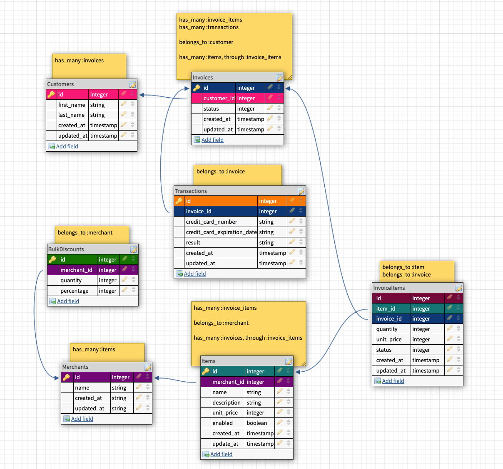

# Bulk Discounts

<!-- TABLE OF CONTENTS -->
<details open="open">
  <summary>Table of Contents</summary>
  <ol>
    <li>
      <a href="#about-the-project">About The Project</a>
      <ul>
        <li><a href="#learning-goals">Learning Goals</a></li>
        <li><a href="#built-with">Built With</a></li>
      </ul>
    </li>
    <li>
      <a href="#getting-started">Getting Started</a>
    </li>
    <li><a href="#database-schema">Database Schema</a></li>
    <li><a href="#roadmap">Roadmap</a></li>
    <li><a href="#contributors">Contributors</a></li>
  </ol>
</details>


## About the Project

This project is an extension of the Little Esty Shop group project. You will add functionality for merchants to create bulk discounts for their items. A “bulk discount” is a discount based on the quantity of items the customer is buying, for example “20% off orders of 10 or more items”.


### Learning Goals

* Write migrations to create tables and relationships between tables
* Implement CRUD functionality for a resource using forms (form_tag or form_with), buttons, and links
* Use MVC to organize code effectively, limiting the amount of logic included in views and controllers
* Use built-in ActiveRecord methods to join multiple tables of data, make calculations, and group data based on one or more attributes
* Write model tests that fully cover the data logic of the application
* Write feature tests that fully cover the functionality of the application


### Built With

| Development                                                   | Testing       | Gems                                                              |
|   :----:                                                      |    :----:     |    :----:                                                         |
| Ruby 2.7.2                                                    | RSpec         | [Capybara](https://github.com/teamcapybara/capybara)              |
| Rails 5.2.5                                                   |               | [Factorybot](https://github.com/thoughtbot/factory_bot)           |
| [Bootstrap](https://getbootstrap.com)                         |               | [Faker](https://github.com/faker-ruby/faker)                      |
| HTML5                                                         |               | [Faraday](https://lostisland.github.io/faraday/)                  |
| [Node](https://nodejs.org/en/download/package-manager/#macos) |               | [Launchy](https://github.com/copiousfreetime/launchy)             |
| [Atom](https://atom.io/)                                      |               | [Orderly](https://github.com/jmondo/orderly)                      |
| [GitHub](https://github.com/)                                 |               | Pry                                                               |
|                                                               |               | [ShouldaMatchers](https://github.com/thoughtbot/shoulda-matchers) |
|                                                               |               | [SimpleCov](https://github.com/simplecov-ruby/simplecov)          |


## Getting Started

1. Fork this repo
2. Clone the repo
   ```
   git clone https://github.com/your_username_/Project-Name.git
   ```
3. Install node
   ```
   brew install node
   ```
4. Run
   ```
   bundle install
   ```
   ```
   bundle update
   ```


<!-- USAGE EXAMPLES -->
## Database Schema



<!-- ROADMAP -->
## Roadmap

1. [Database Setup](./doc/bulk_discounts_examples.md)
1. [User Stories](./doc/bulk_discounts_user_stories.md)
1. [Extensions](./doc/bulk_discounts_extensions.md)
1. [Evaluation](./doc/bulk_discounts_evaluation.md)


<!-- CONTRIBUTING -->
## Contributors

👩🏻‍💻 Caroline Tan
[GitHub](https://github.com/carolinectan)
[LinkedIn](https://www.linkedin.com/in/carolinectan/)
